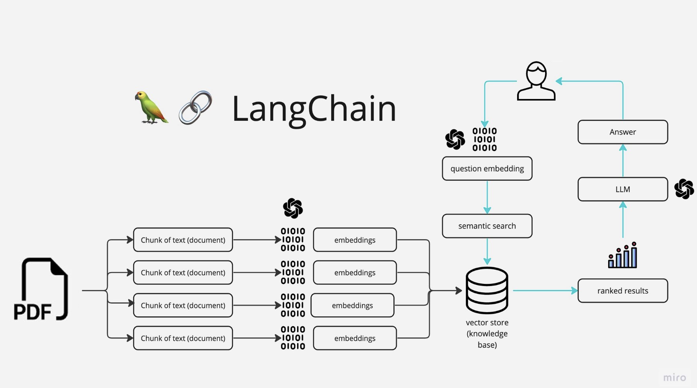

# Langchain Streamlit QnA Chatbot

The Langchain Streamlit QnA Chatbot is a Python application that allows you to chat with a contract PDF document. You can ask specific questions regarding the information in the contract using natural language and the application will provide relevant responses based on the content of the PDF. The app utilizes a language model to generate accurate answers to the users questions. Please note that the app will only respond to questions related to the loaded contract PDFs. 

# How the App Works



The application follows these steps to provide responses to the user's questions:
1. **PDF Loading:** The app reads a PDF document and extracts the text content.
2. **Text Chunking:** The extracted text is divided into smaller chunks that can be processed effectively.
3. **Embedding Model:** The application utilizes a embedding model to generate embeddings (vector representations) of the text chunks.
4. **Similarity Matching:** When the user asks a question, the app compares it with the text chunks and identifies the most semantically similar ones.
5. **Response Generation:** The selected chunks are passed to the language model, which generates a response based on the relevant content of the PDFs.

# Dependencies and Installation

To install the Langchain Streamlit QnA Chatbot App, please follow these steps:
1. Clone the repository to your local machine.
2. Install the required dependencies by running the following command in terminal:
    ```pip install -r requirements.txt```
3. Obtain Azure OpenAI API key and add it to a configuration file in the project directory.
    - See example configuration file

# Using the Langchain Streamlit QnA Chatbot App
To use the app, follow these steps:

1. Ensure that you have installed the required dependencies and added the Azure OpenAI API key to the .cfg file.
2. Open terminal and excecute the following command:
    ```streamlit run langchainQnA.py```
3. The application will launch in your default web browser, displaying the UI.
4. Load the PDF into the app.
5. Ask questions in natural language abou the loaded PDF using the chat interface.


